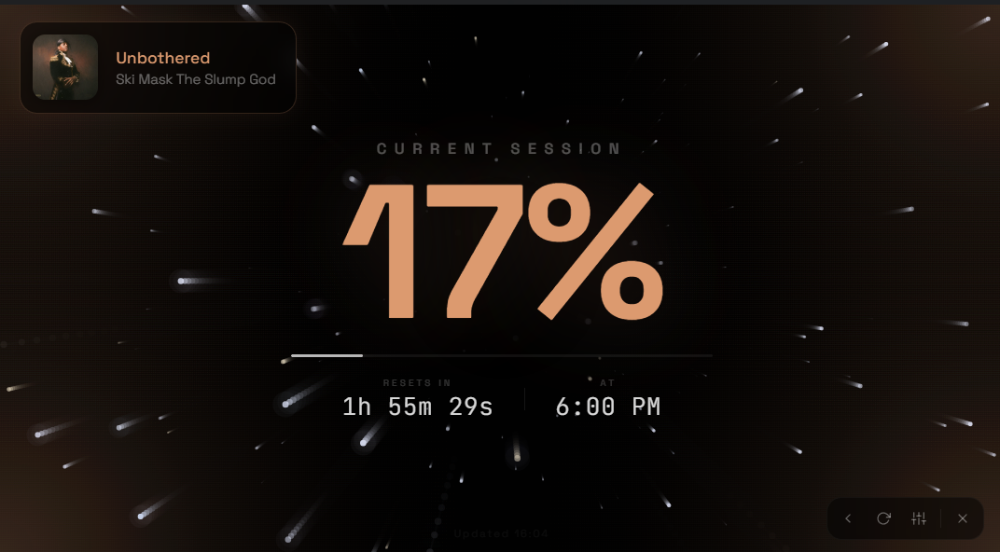

# Claude Usage Space

A sleek, real-time desktop widget for monitoring your Claude AI usage. Built with Electron, featuring a deep space starfield, music-reactive visualizations, and a 3D planet scene.



## Features

### Usage Monitoring
- **Real-time session tracking** - See your current 5-hour session utilization as a large percentage
- **Weekly usage view** - Optional 7-day utilization tracking
- **Auto-refresh** - Updates every 30 seconds with countdown timer to next reset
- **Money mode** - Track estimated API costs with a real-time dollar counter and burn rate

### Music Visualization
- **SMTC integration** - Detects currently playing music via Windows System Media Transport Controls
- **Album art** - Fetched from SMTC thumbnails with Deezer/iTunes fallback
- **Bass-reactive starfield** - Stars accelerate, glow, and streak on bass hits
- **Intelligent beat detection** - Spectral flux analysis, BPM tracking, and adaptive thresholds
- **Corner glow** - Colored light pulses from screen corners synced to bass, tinted by album art colors
- **Screen shake** - Spring-physics screen shake on heavy kicks
- **Comet trails** - Rare comets streak across the screen on strong bass kicks
- **Shockwave** - Circular ripple effect when the song changes
- **Theme colors** - Dominant color extracted from album art tints the UI, glow, and planet

### Visual Effects
- **Deep space starfield** - 200 parallax stars with depth, streaks, and glow halos
- **Gravitational collapse** - Stars pull toward center like a black hole at 90%+ usage
- **Screen cracks** - Glowing lava fractures replace red corner pulse at 95%+ usage
- **3D planet scene** - Interactive purple planet with cloud layers, shown during settings (Three.js)
- **Planet music tinting** - Planet lights and materials shift color based on the current song

### Customization
- **Font color** - Preset swatches or custom hex
- **Font size** - 50%-200% scaling affects all UI elements and planet size
- **Bass glow color** - Auto (from album art) or manual color selection
- **Toggles** - Music visualization, bass glow, money mode, weekly view

## Architecture

```
claude-usage-space/
  main.js              # Electron main process - window, IPC, SMTC, auth
  preload.js           # Context bridge - secure IPC exposure
  src/
    index.html         # App shell - screens, controls, canvas layers
    renderer.js        # Renderer process - UI, starfield, music analysis, effects
    planet.js          # 3D planet scene (ES module, bundled via esbuild)
    planet.bundle.js   # Bundled planet + Three.js + GLTFLoader
    styles.css         # All styles - dark theme, responsive, animations
    fetch-via-window.js # Cloudflare-bypassing fetch via hidden BrowserWindow
    purple_planet.glb  # 3D planet model (GLB format)
  assets/
    icon.png           # App icon
```

### Key Technical Details

**Authentication** - Session keys are encrypted at rest using Electron's `safeStorage` API. Login flow supports both auto-detect (opens Claude login window, captures session cookie) and manual session key paste.

**Usage Fetching** - Uses a hidden `BrowserWindow` to make authenticated requests to Claude's internal API, bypassing Cloudflare bot detection that blocks raw `fetch()` calls.

**Music Detection** - A persistent PowerShell process communicates with Windows SMTC (System Media Transport Controls) to get the current song title, artist, album art thumbnail, and playback status. Polled every 2.5 seconds via stdin/stdout.

**Audio Capture** - System audio is captured via `getDisplayMedia` with loopback audio for real-time frequency analysis. A 512-bin FFT feeds the bass detection system with sub-bass, bass, mid, and total energy bands.

**Beat Detection** - Dual-speed envelope follower (fast attack/slow release) combined with spectral flux onset detection. BPM is calculated using interquartile mean of beat intervals for outlier robustness. Beat phase tracking enables future sync features.

**Album Art Fallback** - When SMTC doesn't provide a thumbnail, the app queries Deezer API first (best coverage), then iTunes Search API. Search queries are cleaned of `(feat. X)`, `[Remix]`, and other metadata noise.

**3D Planet** - Three.js scene loaded from a GLB model with 3 meshes (planet surface + 2 cloud layers). Bundled with esbuild into a single IIFE file. Cloud layers rotate at different speeds for parallax. Atmospheric glow sphere and emissive material tinting react to music theme color.

## Setup

### Prerequisites
- Node.js 18+
- Windows 10/11 (SMTC music detection requires Windows)

### Development

```bash
# Install dependencies
npm install

# Run in development mode
npm start

# Run with DevTools
npm run dev
```

### Build

```bash
# Build Windows installer + portable
npm run build:win
```

Output in `dist/`:
- `Claude Usage Space-1.0.0-Setup.exe` - NSIS installer
- `Claude Usage Space-1.0.0-Portable.exe` - Portable executable

### Rebuilding the Planet Bundle

If you modify `src/planet.js`, rebuild the bundle:

```bash
npx esbuild src/planet.js --bundle --format=iife --outfile=src/planet.bundle.js
```

## Usage

1. Launch the app
2. Click **Log in with Claude** to authenticate (opens Claude login page)
3. Or paste your session key manually
4. Your usage appears as a large percentage with countdown to reset

### Settings (gear icon)
- Toggle music visualization, bass glow, money mode, weekly view
- Change glow color, font color, font size
- Configure money mode cost-per-session
- Opens 3D planet scene in background

### Music
- Enable "Music Visualization" in settings
- Play any music on your system (Spotify, browser, etc.)
- Grant screen share permission when prompted (needed for audio capture)
- Stars, glow, and effects react to the music in real-time

### Keyboard Shortcuts
- `F11` or `Alt+Enter` - Toggle fullscreen

## License

MIT
